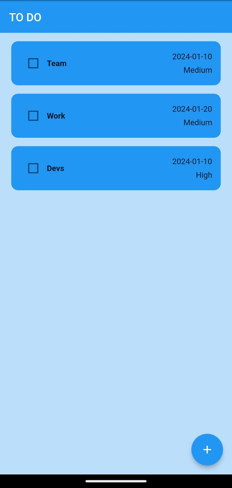
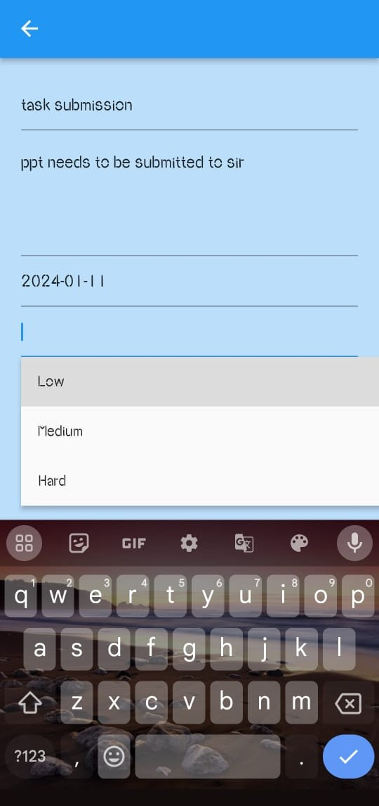

# To-Do List App

## Introduction

I've always relied on to-do lists, and for my first independent Dart/Flutter project, I chose to create a to-do list app. This simple application not only helped me solidify theoretical concepts but also allowed me to apply them in a practical setting.

## Key Features

- **Task Creation:** Users can create tasks by clicking on the '+' button.
- **Task Completion:** Mark tasks as done with a simple click.
- **Due Dates:** Set due dates when creating a task.
- **Task Deletion:** Easily delete tasks by sliding them from right to left.
- **Priority Levels:** Assign priority levels (Low, Medium, or High) to tasks.
- **Additional Details:** Add a title and description for each task.
- **Local Storage:** Utilizes local storage for seamless data persistence.
- **Clean and Responsive UI:** User-friendly interface with a responsive design.

## Technical Specifications

- **Platform:** Android
- **Language:** Flutter
- **Data Storage:** Utilizes Hive for efficient local data storage.

## Application Set-Up
- To install Flutter, please follow these steps:

- [Click Here](https://docs.flutter.dev/get-started/install/windows/mobile) to access the installation instructions.
- Clone my application repository.
- Run the application.

## Contribution
Contributions are welcome! If you want to contribute to the project, please create a pull request with a detailed explanation of the changes.
  
   <h1>Screenshots</h1>
 
 <b>Homepage</b>
  
  
  
  
  
 <b>Add New Task</b>
  
 
  
 <b>Pick Date and Choose Priority Level</b>
  
 
 
  
  
 <b>Task Details</b>
  
  
  
 <b>Task deletion>
  
  
  
